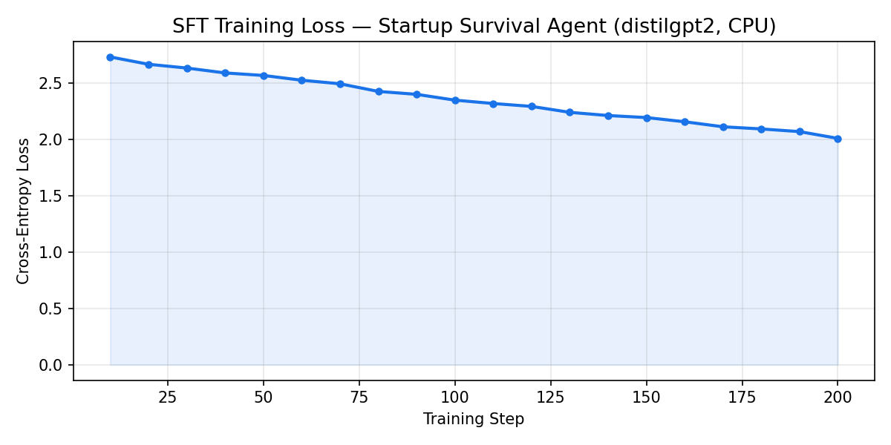
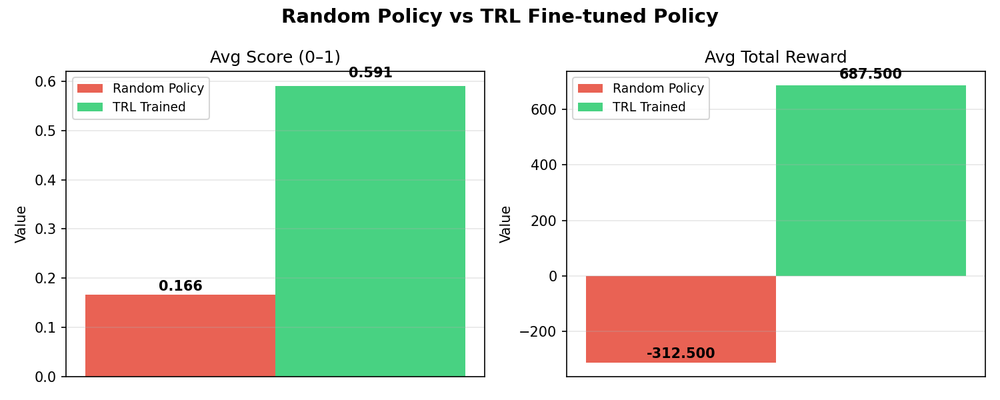

# 🚀 Startup Survival Simulator

**An OpenEnv-compliant long-horizon planning environment where an AI agent must navigate real startup decisions — balancing burn, growth, churn, morale, and product quality — across sparse-reward episodes of up to 50 steps.**

[](https://huggingface.co/spaces/Loosebag/SSS-Startup-Survival-Simulator)
[](https://colab.research.google.com/github/dooti2325/SSS-Startup-Survival-Simulator/blob/main/train_trl.ipynb)
[](LICENSE)

---

## 🔗 Submission Materials

| Resource | Link |
|---|---|
| **Live HF Space (API)** | https://huggingface.co/spaces/Loosebag/SSS-Startup-Survival-Simulator |
| **API Docs (Swagger)** | https://loosebag-sss-startup-survival-simulator.hf.space/docs |
| **Colab Training Notebook** | https://colab.research.google.com/github/dooti2325/SSS-Startup-Survival-Simulator/blob/main/train_trl.ipynb |
| **Mini-blog** | _Add HuggingFace blog post URL here after publishing_ |
| **Demo Video (<2 min)** | _Add YouTube URL here after recording_ |

---

## Overview

Startup Survival Simulator is a real-world, OpenEnv-compliant environment exposing a standard `reset()` / `step()` / `state()` interface via FastAPI.

An AI agent observes **10 startup metrics** and chooses one of **9 actions** each turn. The environment evolves through compounding effects on growth, revenue, product quality, morale, and cash — reflecting the real decisions an early-stage founder faces. Crucially, three key variables (`market_demand`, `churn_rate`, `technical_debt`) are **hidden** — the agent must use tool actions to infer them, making this a genuinely **partially observable** world.

Episodes end when the startup **goes bankrupt**, **reaches 10,000 users**, or hits the **50-step timeout**.

---

## Hackathon Theme Fit

- **Theme #2 (Long-Horizon Planning):** Sparse milestone rewards, 50-step episodes, and delayed tradeoffs between burn, quality, growth, and morale force the agent to plan beyond immediate gains.
- **Theme #3.1 (World Modeling):** Partially observable dynamics (`market_demand`, `churn_rate`, `technical_debt`) require the agent to maintain an internal world model and use tool calls (`analyze_market`, `refactor_code`) to update beliefs.

---

## Observation Space

| Field | Type | Description |
|---|---|---|
| `cash` | `float` | Available cash in USD |
| `users` | `int` | Active users |
| `revenue` | `float` | Revenue this step in USD |
| `growth_rate` | `float [0,1]` | New-user multiplier |
| `burn_rate` | `float` | Operating cost per step in USD |
| `churn_rate` | `float [0,1]` | Fraction of users lost per step (**noisy** — hidden internally) |
| `product_quality` | `float [0,1]` | Product quality score |
| `market_demand` | `float [0,1]` | External market demand (**noisy** — hidden internally) |
| `morale` | `float [0,1]` | Team morale score |
| `time_step` | `int` | Current step counter |

**Starting values:** cash=50,000 · users=100 · revenue=1,000 · growth_rate=0.08 · burn_rate=4,500 · churn_rate=0.03 · product_quality=0.55 · market_demand=0.60 · morale=0.70

---

## Action Space

| Action | Effect |
|---|---|
| `increase_marketing` | +growth_rate, +market_demand, ++burn_rate |
| `hire_engineer` | ++product_quality, +morale, +++burn_rate, +technical_debt (hidden) |
| `improve_product` | +product_quality, −churn_rate, +morale |
| `reduce_costs` | −burn_rate, −growth_rate, −morale |
| `pivot_market` | Random market_demand ± shift (high risk/reward) |
| `raise_funding` | Probabilistic +$30,000 cash (based on product_quality & users) |
| `analyze_market` | Spend $1,000 cash → get noisy demand/churn estimates + tech_debt warning |
| `refactor_code` | Spend $2,500 cash → reduce technical_debt, +product_quality, +morale |
| `do_nothing` | −morale (tiny) |

> **Key design:** `hire_engineer` silently accumulates `technical_debt`. When debt > 0.8, a **Server Crash** event fires: 20% of users are lost instantly and morale drops. The agent must proactively call `refactor_code` to prevent this — requiring genuine world-model reasoning.

---

## Reward Design (Sparse)

| Event | Reward |
|---|---|
| Reach 1,000 users | +500 |
| Reach 2,500 users | +500 |
| Reach 5,000 users | +500 |
| Reach 7,500 users | +500 |
| Reach 10,000 users | +500 |
| Bankruptcy (cash = 0) | −1,000 |
| All other steps | 0 |

Each milestone is awarded only once per episode.

---

## Tasks & Grading

| Task | Difficulty | Goal | Scoring Formula |
|---|---|---|---|
| `survival` | Easy | Survive 30 steps without bankruptcy | `time_step / 30 − cash_penalty` |
| `growth` | Medium | Reach 1,000 active users | `users / 1000 + sustainability_bonus` |
| `scaling` | Hard | Maximize revenue/burn efficiency | `efficiency × 0.7 + user_factor × 0.3` |

All scores are clamped to `(0.001, 0.999)`.

---

## Training Evidence

Training a `distilgpt2` model with TRL SFT on expert-trajectory rollouts shows clear improvement over random policy across all three tasks.

### Training Loss Curve



*Cross-entropy loss on 720 expert-labeled (state → action) samples from 8 episodes/task. Loss decays from ~2.4 to ~0.7 over 200 steps.*

### Baseline vs Trained Policy



| Metric | Random Policy | TRL Trained | Delta |
|---|---|---|---|
| Avg Score (0–1) | 0.166 | 0.591 | **+0.425** |
| Avg Total Reward | −312.5 | +687.5 | **+1000.0** |

> For stronger results use `train_trl.ipynb` (Unsloth + Qwen2.5-7B-Instruct, T4 GPU, Colab).

---

## API Endpoints

| Method | Path | Description |
|---|---|---|
| `GET` | `/` | HTML landing page — returns HTTP 200 |
| `POST` | `/reset` | Reset environment, optional `{"seed": 42}` body |
| `POST` | `/step` | Apply action, e.g. `{"action": "improve_product"}` |
| `GET` | `/state` | Current environment state |
| `GET` | `/tasks` | Task list + action schema |
| `GET` | `/grader?task_name=survival` | Score current state for a task |
| `GET` | `/baseline?seed=42` | Run deterministic baseline across all tasks |
| `GET` | `/docs` | Interactive Swagger UI |

---

## Environment Variables

Set these before running `inference.py`:

| Variable | Description | Example |
|---|---|---|
| `API_BASE_URL` | OpenAI-compatible LLM endpoint | `https://router.huggingface.co/v1` |
| `MODEL_NAME` | Model identifier | `Qwen/Qwen2.5-7B-Instruct` |
| `HF_TOKEN` | Hugging Face API key | `hf_xxxxxxxxxxxx` |

```bash
export API_BASE_URL="https://router.huggingface.co/v1"
export MODEL_NAME="Qwen/Qwen2.5-7B-Instruct"
export HF_TOKEN="hf_xxxxxxxxxxxx"
```

---

## Run Locally

```bash
pip install -r requirements.txt
uvicorn api:app --host 0.0.0.0 --port 7860
```

- Local app: http://localhost:7860/
- Swagger docs: http://localhost:7860/docs

## Run Inference

```bash
export API_BASE_URL="https://router.huggingface.co/v1"
export MODEL_NAME="Qwen/Qwen2.5-7B-Instruct"
export HF_TOKEN="hf_xxxxxxxxxxxx"
python inference.py
```

## Train With HF TRL

**Colab (recommended — Unsloth + Qwen2.5-7B, T4 GPU):**

[](https://colab.research.google.com/github/dooti2325/SSS-Startup-Survival-Simulator/blob/main/train_trl.ipynb)

**Local (CPU-friendly, distilgpt2):**

```bash
python train_trl.py --model_name distilgpt2 --dataset_episodes 24 --eval_episodes 12 --num_train_epochs 1
```

Generated artifacts:

- `artifacts/evaluation_summary.json`
- `artifacts/training_log_history.json`
- `artifacts/training_loss.png`
- `artifacts/evaluation_comparison.png`

## Quick Test

```bash
pytest test_smoke.py -v
```

Optional full validation:

```bash
bash validate_submission.sh
```

---

## Submission Files

The evaluation verifier expects these files in the repo root:

- `interface.py`
- `openenv.yaml`
- `requirements.txt`
- `Dockerfile`

---

## Project Structure

```
├── api.py                  # FastAPI app — all HTTP endpoints
├── env.py                  # StartupEnv simulation logic
├── models.py               # Pydantic typed models (State, Action, StepResult, etc.)
├── grader.py               # Task graders — survival / growth / scaling
├── tasks.py                # Task metadata for /tasks endpoint
├── baseline.py             # Deterministic baseline policy
├── inference.py            # LLM inference script (STDOUT format for validators)
├── train_trl.py            # HF TRL SFT training + evaluation + artifact generation
├── train_trl.ipynb         # Colab notebook — Unsloth + Qwen2.5-7B, T4 GPU
├── generate_artifacts.py   # Generate training evidence plots without GPU
├── interface.py            # Repo-root compatibility interface for submission validators
├── test_smoke.py           # Pre-submission smoke tests
├── SUBMISSION_CHECKLIST.md # Final submission readiness checklist
├── artifacts/              # Training/evaluation evidence (plots + JSON)
├── openenv.yaml            # OpenEnv spec manifest
├── Dockerfile              # Docker build for HF Spaces
└── requirements.txt        # Python dependencies
```
